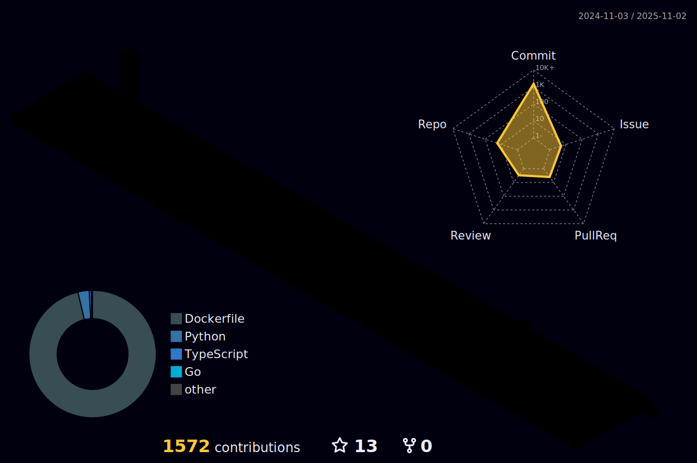

 

  
  
 

<h1 align="center">
  
</h1>

<h2 align="center">
  
</h2>

<h3 align="center">A passionate student from Japan
</h3>
 

<h3 align="left">Connect with me:</h3>
<h5 align="center"> 
 <!--  -->
 <!--  -->
 
 
 
 <!--  -->
 <!--  -->
 
 <!--  -->
 <!--  -->
</h5>

<h2 align="center">🔥 Learning Languages & Frameworks & Tools & Abilities 🔥</h2>

 
  

    
<b>Programming Languages</b>

     
    

    
    
     
     
     
     
     
    
   

  

  
  

   
<b> Frontend Development</b>

   

     
     
     
     
     
     
     
     
     
    
   

  

  

   
<b>Backend Development</b>

   
 
     
     
     
     
   

  

  

  
 <b>Database</b>

  

   
     
     
     
     
     
  

  

  

  
<b>Data Visualization</b>

  
 
   
   
  

  

  

  
<b>Devops</b>

  

   
   
   
   
   
   
   
  

  

  

  
<b>Backend as a Service(BaaS)</b>

  

   
   
  

  

  

  
<b>Framework</b>

  

  
   
   
  

  

  

  
<b>Software</b>

  
 
  
  

  

  

  
<b>Static Site Generators</b>

  
 
  
  
  

  

  

  
<b>Other</b>

  

  
  
  

  

<h2 align="center">⚡ Activity ⚡</h2>

 

 
 
 
 
 

 

  
  

  

  

<!--START_SECTION:lapras-card-->

  
Last Updated on 1/25/2024, 1:08:42 AM

<!--END_SECTION:lapras-card-->

 <h5>More Details</h5>
 

<!--
<h2 align="center">👨‍💻 Repositories 👨‍💻</h2>

  

      

  
  

      

  
  

      

  
  

      
<h4 align="center">
  <a href="https://github.com/zumrudu-anka?tab=repositories" title="Show Repositories">🔎 Show More 🔍</a>
</h4>
!-->

